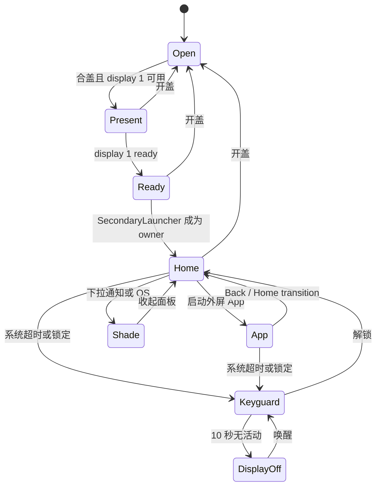
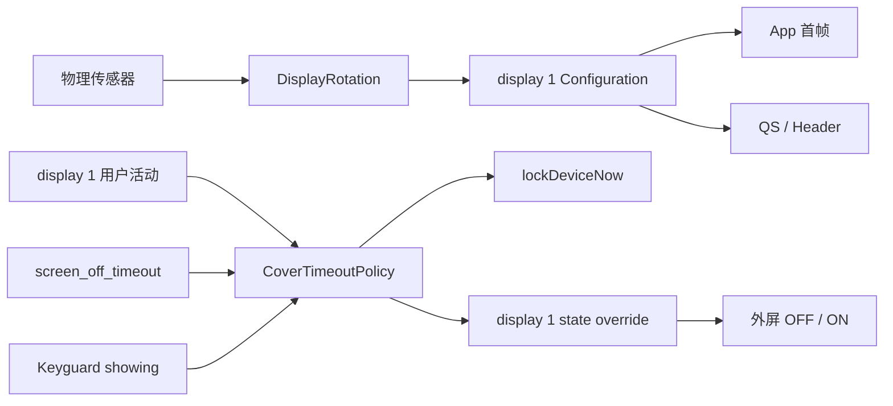

# FlexUnlock 1.4.x 实现说明

本文说明 1.4.x 的模块职责、数据流、关键策略和验证边界。使用与安装请阅读 [README.md](README.md)，版本变化请阅读 [CHANGELOG.md](CHANGELOG.md)。

## 1. 构建与模块边界

当前唯一发布入口是 `cover-shell`：

```text
cover-shell APK
├── cover-shell/src/main/java
│   ├── 模块入口与运行时事实
│   ├── SystemUI / Launcher / Recents Hook
│   └── 模块控制页与设置页
└── system-bridge/src/main/java（通过 sourceSets 编入）
    ├── system_server Hook
    ├── 外屏会话协调
    ├──方向与系统装饰策略
    └── 独立锁屏/息屏策略
```

`app` 和 `system-bridge` 目录保留各自 Gradle 配置用于历史维护，但 `settings.gradle.kts` 当前只包含 `:cover-shell`。运行时事实应以最终 APK、加载日志和系统行为为准。

版本由根目录统一提供：

```text
gradle.properties
  ├── VERSION_NAME
  └── VERSION_CODE
       ├── cover-shell/build.gradle.kts
       ├── app/build.gradle.kts
       └── system-bridge/build.gradle.kts
```

## 2. 运行时进程职责

| 进程 | 主要职责 |
| --- | --- |
| `system_server` | display 1 会话、方向裁决、Keyguard 请求、独立显示状态覆盖 |
| `com.android.systemui` | 外屏 Header、通知、QS、Insets 与 Configuration 同步 |
| 三星 Launcher / Quickstep | `SecondaryLauncher`、抽屉、Recents、Home transition、底边手势 |
| 模块 App | 状态展示、外屏控制、设置、允许列表和更新入口 |

所有关键策略先检查 display ID 和合盖会话，避免把外屏逻辑扩散到 display 0。

## 3. 外屏会话与状态流



`CoverSessionCoordinator` 负责把 Fold、display state 和系统上下文变化分发到各策略。恢复动作以会话代次门控，不使用持续拉起 Activity 的循环。

## 4. QS 旋转修复

### 问题

三星 `SubScreenQuickPanelWindowController` 对普通 90°/270°变化不会完整重建已渲染的 `SOURCE_PANEL`。仅调用 `requestLayout()` 仍可能保留旧的窗口 Configuration 和 Insets。

### 实现

`NativeCoverStatusBarHooks` 为 SystemUI 注册 display listener：

1. 只接收 display 1 的变化。
2. 通过 `createDisplayContext(display1)` 获取最新 display-specific `Configuration`。
3. 向 `mSubScreenQsWindowView` 显式分发 Configuration。
4. 重新请求 Insets、layout 和 invalidate。
5. 下一帧再次执行 Header/window 状态归约。
6. QS 相关窗口方向保持 `SCREEN_ORIENTATION_UNSPECIFIED`，不让三星控制器缓存固定旧方向。

该路径仍使用三星原生通知、QS 和分页组件，不创建替代面板。

## 5. App 首帧方向修复

### 问题

物理旋转后启动 App 时，Samsung cover 分支可能先基于旧 rotation 创建 Activity configuration，随后传感器更新再跳到正确方向，表现为“先 0°，再旋转”。

### 实现

分为两层：

1. `ActivityRecord.getOrientation`：display 1 的普通 App 传感器跟随请求归一为 `FULL_SENSOR`。
2. `DisplayRotation.rotationForOrientation`：在 WMS 创建首帧 configuration 前，以 `mLastSensorRotation` 纠正结果；传感器暂无值时回退当前 display rotation。

首帧纠正谓词包含 `FULL_SENSOR`，避免方向刚被归一后反而绕过纠正。

## 6. Recents 与底边手势

### Recents

- snapshot、thumbnail 和 live surface 都以 display 1 当前真实 rotation 为输入。
- 动态旋转时更新 surface 几何，不通过任务迁移或 reparent 修复。
- 保留三星/Quickstep 的原始 task owner 与 transition。

### 底边手势

手势区域基于“当前物理底边”归一，而不是固定屏幕坐标：

```text
physical bottom edge
├── 0% - 33%   RECENTS
├── 33% - 66%  HOME
└── 66% - 100% BACK
```

左下异形区属于背景绘制范围，但交互区域仍按物理底边和安全区解析。

## 7. 解锁态系统超时

### 原因

外屏 display 1 与主屏属于同一 `displayGroupId=0`。Android 默认 PowerManager 超时按 power group 工作，无法直接为外屏提供独立超时。历史实现只写入 `cover_screen_timeout=10`，没有接入实际用户活动与电源调度。

### 实现

`CoverTimeoutPolicy` 在 `system_server` 中维护 display 1 的独立计时：

1. 解锁态读取 `Settings.System.SCREEN_OFF_TIMEOUT`。
2. 监听 setting 变化并重排计时。
3. Hook display 1 用户活动和 power-group wake，清除旧 OFF 覆盖并重新计时。
4. 到期调用 `WindowManagerService.lockDeviceNow()` 请求系统 Keyguard。
5. 通过 `DisplayManagerService.setDisplayStateOverrideWithDisplayIdInternal` 仅请求 display 1 OFF。
6. 不调用全局 `goToSleep`，避免影响 display 0。

关键日志：

```text
timeout expired mode=system timeoutMs=... keyguardRequested=true
requested display-1 OFF
```

## 8. 锁屏页面 10 秒息屏

当 `NativeSecondaryHomeRouter` 观察到 Keyguard showing：

- 切换为固定 `10000 ms` 计时。
- 到期只应用 display 1 OFF 覆盖。
- 唤醒时先清除覆盖，再保持 Keyguard 页面。
- 解锁后恢复系统 `screen_off_timeout` 模式。

关键日志：

```text
timeout scheduled reason=keyguard-shown mode=lockscreen timeoutMs=10000
timeout expired mode=lockscreen timeoutMs=10000
```

## 9. 锁屏与唤醒安全边界

`CoverLockTransitionPolicy` 在 `PhoneWindowManager.startedGoingToSleep(...)` 开始时把状态从 `UNLOCKED` 提升为 `LOCK_PENDING`，不等待异步的 `setLockScreenShown(true)`。状态只沿以下方向变化：

```text
UNLOCKED --startedGoingToSleep--> LOCK_PENDING
LOCK_PENDING --Keyguard showing--> LOCKED
LOCKED --Keyguard dismissed--> UNLOCKED
```

`LOCK_PENDING` 和 `LOCKED` 都属于访问受限状态。pending 期间再次唤醒时：

1. display 1 暂时保持 OFF，阻止旧 Launcher 帧先于 Keyguard 可见。
2. 重新提交 `lockDeviceNow()`，并在 Keyguard showing 后释放临时 OFF 覆盖。
3. Secondary Home 解析保持在 SystemUI `SubHomeActivity`，不恢复 `SecondaryLauncher`。
4. pending 期间收到过期的 Keyguard dismissed 回调时保持 fail-closed。

`CoverKeyguardLaunchPolicy` 安装在 `ActivityStarter.isAllowedToStart(...)`。该点已经完成目标 display 的 launch 参数计算，但仍早于 task 创建、resume 和启动电源模式，因此锁屏拦截不依赖 App UI。

判定顺序如下：

1. 仅处理合盖会话中的 display 1。
2. 合并锁屏状态机与 `KeyguardController.isKeyguardLocked(...)`；读取失败时默认拒绝普通 App。
3. 保留 Keyguard、SystemUI、核心 UID 和平台签名系统组件。
4. 对普通外部 App和受限状态下的 `SecondaryLauncher` 返回 `START_ABORTED`（102）。
5. 解锁后恢复原有 Home、允许列表、方向和超时策略。

## 10. App 图标与在线更新说明

- Manifest 同时声明 `android:icon` 和 `android:roundIcon`。
- adaptive icon 前景主体限制在安全区，提供深色背景、圆形蒙版和 Android 13 monochrome 层。
- 更新检查以 GitHub Release API 的 `body` 作为在线说明唯一来源，同时展示 tag、名称和发布时间。
- Release body 不渲染远端 HTML，按纯文本显示；响应和正文分别限制最大长度，完整格式仍通过 Releases 页面查看。
- 仓库 `CHANGELOG.md` 继续承担离线、可版本控制的发布历史。

## 11. 数据流约束



约束：

- display 0 不进入外屏 OFF 计时器。
- QS 不修改全局 resources configuration。
- App 首帧不依赖 Activity 启动后的二次旋转补丁。
- Recents 不迁移任务、不 reparent task。
- 用户活动是清除 OFF 覆盖和重排计时的唯一主要入口之一。

## 12. 1.4.x 验证结果

已完成：

- Gradle `:cover-shell:lintDebug`。
- Gradle `:cover-shell:assembleDebug`。
- APK 安装与完整重启。
- 0°桌面、Activity configuration 和 SystemUI Hook 加载。
- 解锁态临时 5 秒超时：Keyguard showing、input restricted、display 1 committed OFF。
- 唤醒后保持锁屏，不直接返回 Launcher。
- 锁屏态 10 秒后 display 1 committed OFF。
- 恢复 `screen_off_timeout=600000` 和 `stay-awake=2`。
- crash buffer 为空。
- 1.4.5 模块页面根窗口覆盖 `[0,0][748,720]`，六个导航入口和侧栏版本号完整处于安全区。
- 1.4.5 APK 元数据和设备包信息均为 `1.4.5 / 10405`。
- 允许列表覆盖完整物理显示，独立“取消全部 / 保存”悬浮按钮无公共背景，四个旋转角度共用一致布局。
- 锁屏基线为 Keyguard showing、input restricted，display 1 顶层保持 SystemUI `SubHomeActivity`。
- 锁屏启动控制 App 返回 `START_ABORTED`，日志记录 `blocked locked display-1 App launch`，未创建 App task。
- 解锁后同一控制 App 可在 display 1 正常成为 top-resumed Activity。
- 关于页不再重复展示版本号，更新按钮和 Releases 固定入口保持可达。

需要继续人工复验：

- 最终 1.4.0 构建在真实 90°、180°、270°下的 QS 和 App 首帧。
- 长时间待机及不同 USB/充电状态下的 DeX wake lease 行为。

## 13. 发布归档原则

`build/releases/<version>` 保存：

```text
<version>/
├── source-<version>.zip
├── source-<version>.zip.sha256
├── artifacts/
│   ├── cover-shell-debug.apk
│   └── cover-shell-debug.apk.sha256
├── README.md
├── IMPLEMENTATION.md
├── CHANGELOG.md
└── release-manifest.txt
```

源码 ZIP 从对应版本的发布内容提交生成；随后归档文件进入独立归档提交，annotated tag 指向该归档提交。这样源码快照可复现，同时 tag 包含完整代码、文档和编译产物。